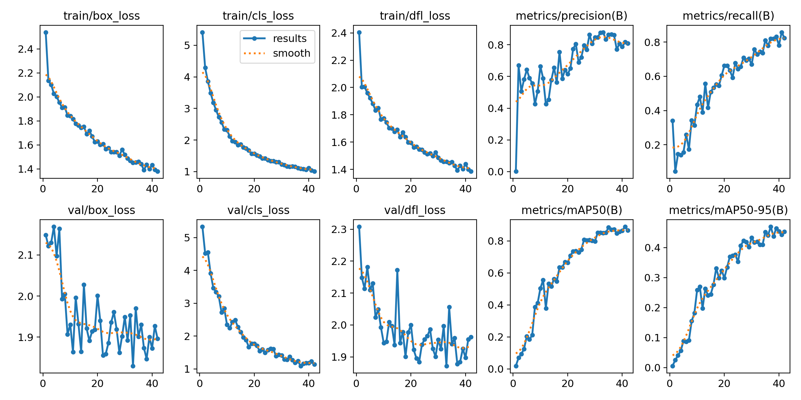
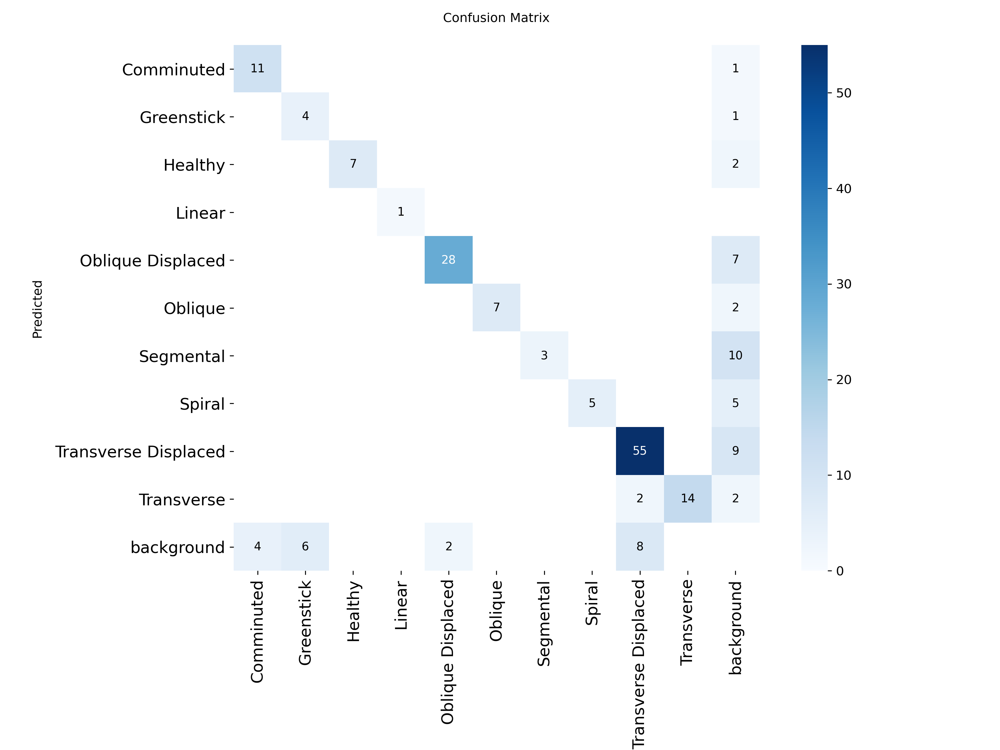
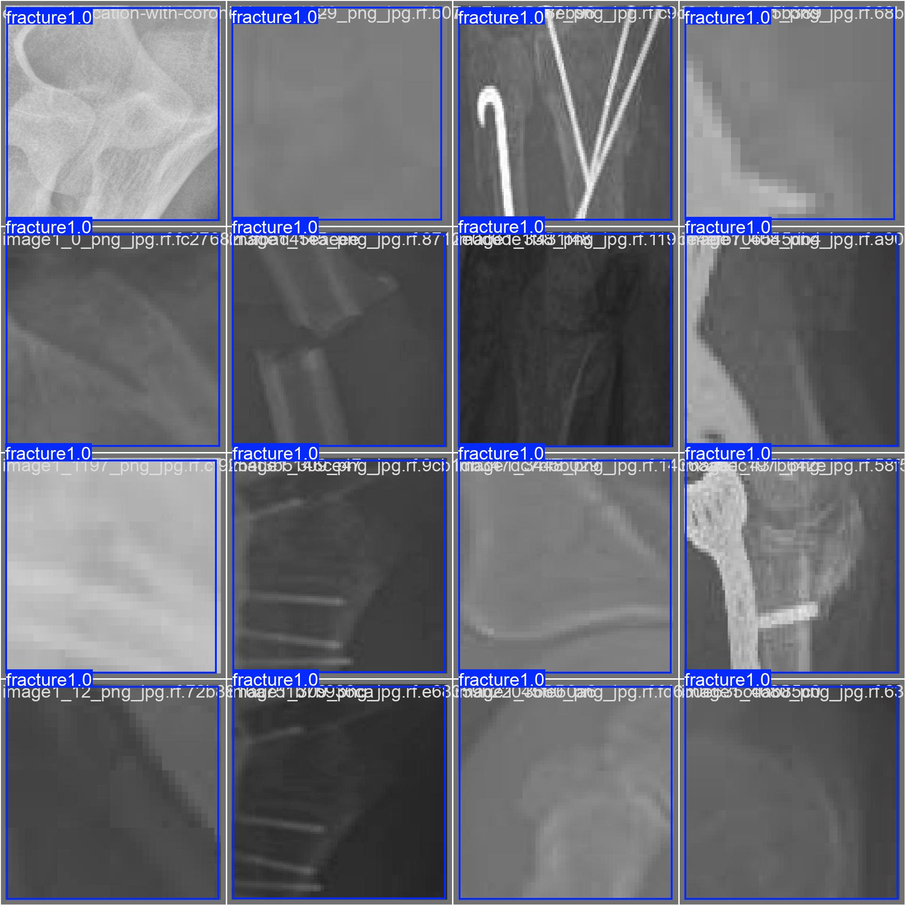
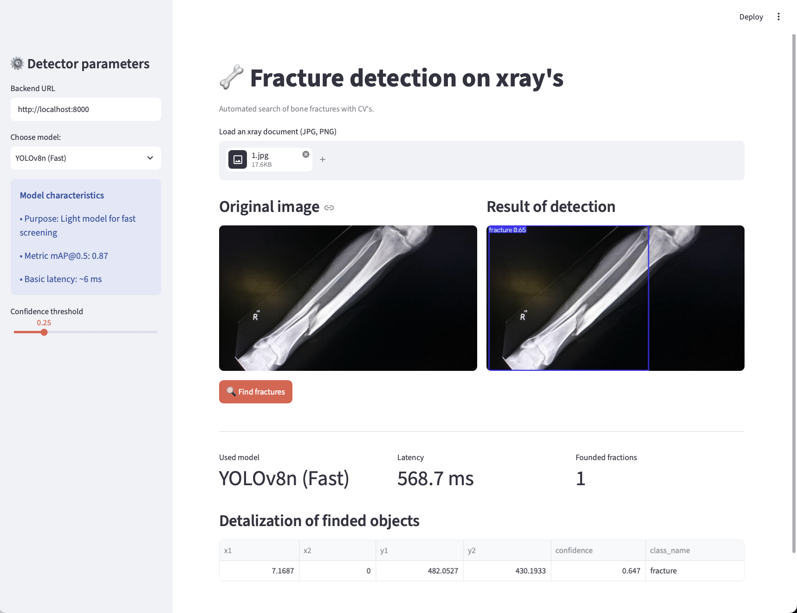

# Bone Fracture Detection MVP (ML Product Track)

End-to-end computer vision service for bone fracture detection on X-ray scans with runtime model selection (Fast vs. Accurate).

---

## 1. Overview
- **Role:** ML Engineer
- **Dataset:** [Human Bone Fractures Multi-modal Image Dataset (HBFMID)](https://www.kaggle.com/datasets/orvile/human-bone-fractures-image-dataset-hbfmid)
- **Task:** Object Detection (`fracture`)
- **Video Presentation:** [Link to Demo Video](#)

---

## 2. Model Benchmarks & Metrics

Target metric: mAP@0.5 >= 0.5.

| Model | Architecture | Checkpoint | Size | Params | mAP@0.5 | CPU Latency | Use Case |
| :--- | :--- | :--- | :--- | :--- | :--- | :--- | :--- |
| **Fast** | YOLOv8n | `weights/model_fast.pt` | ~6.2 MB | 3.2M | **0.87** | ~35 ms | Real-time |
| **Accurate** | YOLOv8m | `weights/model_accurate.pt` | ~52.0 MB | 25.9M | **0.92** | ~260 ms | Clinical review |

### Training Performance & Visualizations

| Training Curves & Metrics | Confusion Matrix |
| :---: | :---: |
|  |  |

| Model Predictions on Validation Set |
| :---: |
|  |

*Training curves and confusion matrices are stored in `docs/`.*

---

## 3. System Architecture

[ Client / Browser ] <-> [ Streamlit Frontend ] <-> (HTTP / REST) <─> [ FastAPI Backend ] <-> |[ YOLOv8n ] | [ YOLOv8m ]|

### API Specification
- `GET /health` — Service readiness probe.
- `GET /models` — Available model list and performance metadata.
- `POST /predict` — Multipart upload (`file`, `model_name`, `conf_threshold`). Returns bounding boxes, confidence, latency (ms), and base64-encoded labeled image.

---

## 4. Setup & Execution

### Installation
```bash
git clone <REPO_URL>
cd <REPO_NAME>
python -m venv venv
source venv/bin/activate  # Windows: venv\Scripts\activate
pip install -r requirements.txt
```

### Backend Launch
```bash
uvicorn backend.main:app --port 8000 --reload
```

Swagger UI: http://localhost:8000/docs

### Frontend Launch
```bash
streamlit run frontend/app.py
```

App UI: http://localhost:8501


